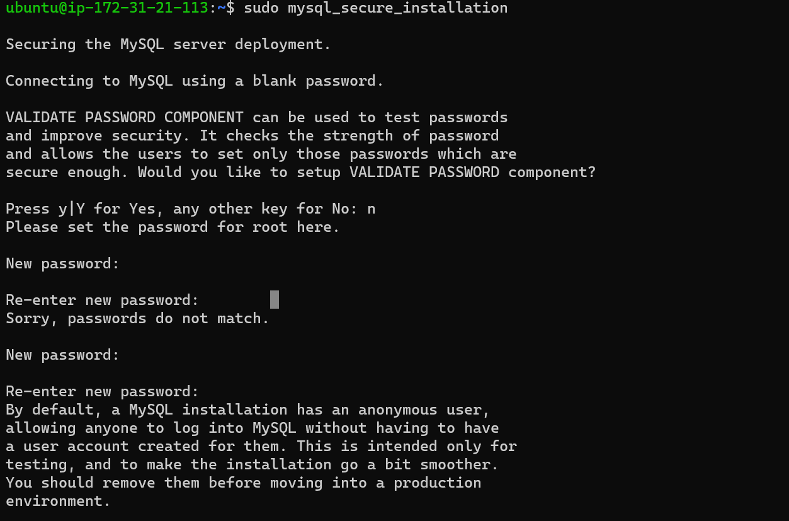

##project-01-documentation

`sudo apt update`

`sudo apt install apache2`

`sudo systemctl status apache2`

[Install-OpenSSH](https://docs.microsoft.com/en-us/windows-server/administration/openssh/openssh_install_firstuse)

[OpenSSH-Key-Management](https://docs.microsoft.com/en-us/windows-server/administration/openssh/openssh_keymanagement)

